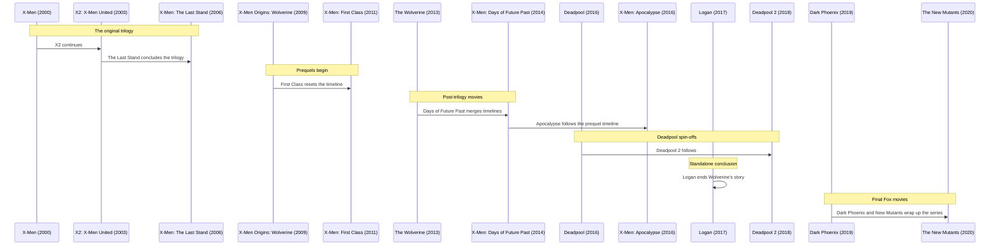

# newice.github.io
##test

```mermaid
sequenceDiagram
    participant X1 as X-Men (2000)
    participant X2 as X2: X-Men United (2003)
    participant X3 as X-Men: The Last Stand (2006)
    participant XO as X-Men Origins: Wolverine (2009)
    participant FA as X-Men: First Class (2011)
    participant TW as The Wolverine (2013)
    participant DF as X-Men: Days of Future Past (2014)
    participant DA as Deadpool (2016)
    participant XA as X-Men: Apocalypse (2016)
    participant L as Logan (2017)
    participant DP2 as Deadpool 2 (2018)
    participant DM as Dark Phoenix (2019)
    participant NM as The New Mutants (2020)

    Note over X1, X3: The original trilogy
    X1->>X2: X2 continues
    X2->>X3: The Last Stand concludes the trilogy

    Note over XO, FA: Prequels begin
    XO->>FA: First Class resets the timeline

    Note over TW, DF: Post-trilogy movies
    TW->>DF: Days of Future Past merges timelines
    DF->>XA: Apocalypse follows the prequel timeline

    Note over DA, DP2: Deadpool spin-offs
    DA->>DP2: Deadpool 2 follows

    Note over L: Standalone conclusion
    L->>L: Logan ends Wolverine’s story

    Note over DM, NM: Final Fox movies
    DM->>NM: Dark Phoenix and New Mutants wrap up the series
```
